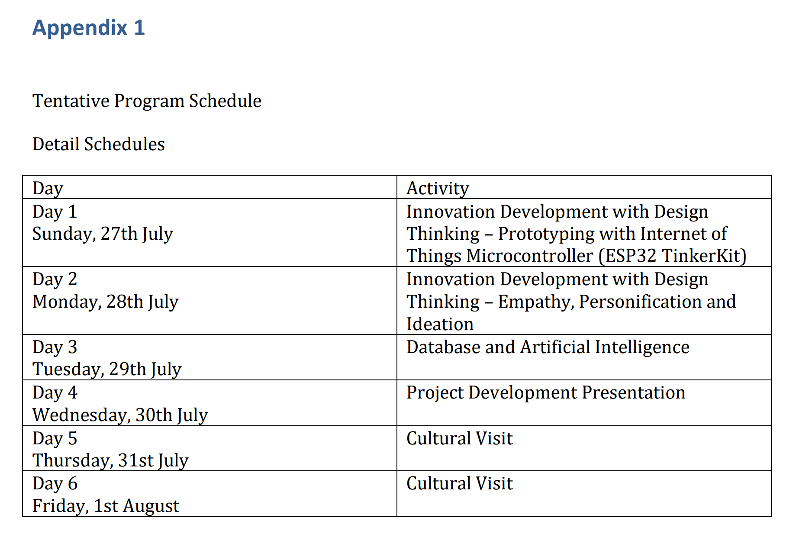

# College of Software Convergence Kookmin University

The **College of Software Convergence** at **Kookmin University** is an academic unit dedicated to educating highly skilled professionals in software and artificial intelligence (AI). The college aims to cultivate globally competitive talent through a curriculum that emphasizes strong fundamentals, practical skills, and industry-oriented education.

### Educational Goals

- To nurture **globally competitive software and AI professionals**
- To provide **practice-oriented education** aligned with real-world industry demands
- To develop students’ abilities to apply software and AI technologies to solve complex problems across various fields

### Academic Divisions

### School of Software

The School of Software focuses on comprehensive software education, ranging from programming fundamentals to advanced application areas such as web systems, data processing, and software security. Students gain solid development skills through systematic coursework and project-based learning.

### School of Artificial Intelligence

The School of Artificial Intelligence offers specialized education in core AI technologies and their applications. The curriculum covers areas such as machine learning, data science, computer vision, natural language processing, and intelligent systems, enabling students to build both theoretical knowledge and practical expertise.

### Educational Features

- **Step-by-step curriculum** from foundational courses to advanced major studies
- **Project-based learning (PBL)** and capstone design courses to enhance hands-on experience
- **Industry collaboration programs** that expose students to real-world problem-solving
- Emphasis on **software convergence**, applying digital technologies across multiple industries

### Career Prospects

Graduates of the College of Software Convergence pursue careers in:

- Software development and IT industries
- Artificial intelligence and data-related fields
- Research institutes and technology-driven startups
- Various sectors requiring software and AI convergence expertise

With the rapid expansion of software and AI across all industries, graduates are well-positioned for diverse and promising career paths.

---

As part of our ongoing discussions on collaboration between **Kookmin University** and **Universiti Teknologi Malaysia (UTM)**, we would like to share several **proposed ideas for undergraduate student recruitment and visiting faculty programs**, particularly in the fields of **Artificial Intelligence, Software, Mechanical Engineering, Robotics, and related interdisciplinary areas**.

We would greatly appreciate your feedback and suggestions on the following proposed models.

---

### **1. Undergraduate Student Recruitment – Proposed Ideas**

**(1) Short-Term Visit and Experiential Programs**

- Short-term research experience programs (2–4 weeks)
- Lab-based experiential programs in AI, Software, Mechanical Engineering, and Robotics
- Summer/Winter School programs during academic breaks

These programs require relatively low commitment and typically attract high participation from undergraduate students.

**(2) Joint Project-Based Recruitment**

- Joint capstone design or project programs involving students from both universities
- Focus on interdisciplinary topics such as AI + Mechanical Engineering / Robotics
- High-performing students may be considered for future exchange or internship opportunities

**(3) Pre-Graduate (Undergraduate-to-Graduate) Recruitment**

- Graduate program information sessions (Master’s/PhD) for outstanding undergraduate students
- Faculty advisor matching sessions
- Online briefings combined with one-on-one meetings with faculty members

**(4) Internship-Linked Recruitment**

- Three-month research internships or industry-linked internship programs
- Students with excellent internship performance may be considered for exchange programs or graduate study opportunities

---

### **2. Visiting Faculty Programs – Proposed Ideas**

**(1) Short-Term Visiting Faculty Program**

- 1–2 week Visiting Professor / Visiting Scholar programs
- Focus on seminars, special lectures, and discussions on potential joint research
- A practical and realistic approach during the early stage of collaboration

**(2) Joint Lectures and Special Courses**

- Online or hybrid joint lectures and special topic courses
- Topics may include AI, Robotics, Autonomous Systems, Data Science, and related areas
- Credit recognition to be determined according to each institution’s internal policies

**(3) Collaborative Research Visits**

- Medium-term research visits (3–6 months)
- Focused on specific collaborative projects such as AI-driven manufacturing, autonomous systems, or smart technologies

**(4) Faculty Co-Supervision Programs**

- Joint supervision of graduate students
- Collaborative research projects and joint publications
- Highly effective for building long-term academic and research networks

Dear Assoc. Prof. Dr. Asrul Izam Azmi,

I hope this message finds you well.

My name is Sang-Chul Kim, and I am with the School of Software at Kookmin University, Republic of Korea.

Your contact information was kindly provided by Mr. Samuel Low Yu Hang.

We would like to kindly invite you to discuss potential collaboration between Universiti Teknologi Malaysia (UTM) and Kookmin University, particularly regarding the establishment of an MoU and possible joint initiatives in the fields of software and computing.

Both institutions share strong academic and research capabilities in areas such as Artificial Intelligence, Data Science, Software Engineering, Cybersecurity, and Intelligent Systems. We believe there are significant opportunities for joint research, academic exchange, and program development.

Additionally, we would greatly appreciate it if you could share information on UTM programs that may align with Kookmin University’s Department of Mechanical Engineering, such as robotics, mechatronics, smart manufacturing, or mobility-related departments/centers. This would help us explore expanded interdisciplinary cooperation between our institutions.

### Proposed Discussion Topics

1. MoU process between UTM and Kookmin University
2. Priority collaboration areas in Software and Computing
3. Information on UTM programs linked to Mechanical Engineering
4. Student exchange opportunities (short programs, joint projects, etc.)
5. Joint seminars, workshops, and research activities
6. Timeline and next steps for institutional cooperation

Your insights and experience will be invaluable to shaping a meaningful partnership between universities.

Thank you very much, and we look forward to your positive response.

Dear Prof Dr Sang-Chul Kim,

Thank you very much for reaching out, and for your kind interest in collaborating with Universiti Teknologi Malaysia (UTM).

From the Faculty of Electrical Engineering, our key strengths that align with your interests include robotics, mechatronics, and control engineering. Other areas of expertise include electronics and computer engineering, electrical power engineering, and communication engineering. Regarding the points you outlined, at the moment I can share with you student exchange opportunities at the Faculty of Electrical Engineering. Our faculty has been actively involved in inbound and outbound mobility activities such as academic visits, summer schools, and research internships. Attached are some examples of activities for inbound visits to our university. For your information, we have also sent our students to Korean universities for internships, including SNU and KAIST in the area of semiconductor research. Regarding joint seminars, workshops, and research activities, we have also conducted such programmes with international partners. I believe these initiatives will depend on the specific research areas shared between our institutions.For the areas of Artificial Intelligence, Data Science, Software Engineering, Cybersecurity, and Intelligent Systems, UTM has strong programmes and research activities mainly under the Faculty of Computing. Since your main priorities are in software and computing, and you also requested information related to Mechanical Engineering, I can connect you with my colleagues from the Faculty of Computing and the Faculty of Mechanical Engineering, if you are okay with that.

Thank you once again for your kind invitation. I look forward to further discussion and to building a meaningful cooperation between Kookmin University and UTM.

Regards,

**Assoc. Prof. Ir. Ts. Dr. Asrul Izam Azmi**

Manager (External & Global Engagement)

Faculty of Electrical Engineering

**Subject: Sincere Thanks for the Introduction**

Dear Assoc. Prof. Ir. Ts. Dr. Asrul Izam Azmi,

I hope this message finds you well.

My name is **Sang-Chul Kim** from Kookmin University.

I would like to express my sincere appreciation for kindly introducing **Dr. Iqbal** from the Faculty of Computing and **Dr. Azman** from the Faculty of Mechanical Engineering.

Thanks to your support and coordination, we are now able to explore potential areas of collaboration between our institutions in a more concrete and efficient manner. Your kind assistance is greatly appreciated and has been instrumental in facilitating these discussions.

We look forward to continued communication and cooperation, and we hope this will lead to meaningful and sustainable collaboration between Universiti Teknologi Malaysia and Kookmin University.

**Subject: Proposed Meeting Dates**

Dear Dr. Asrul and Colleagues from the Faculty of Computing,

Thank you very much for your kind message and warm welcome.

We truly appreciate your interest in exploring collaboration with Kookmin University.

With regard to the meeting, we would like to propose the following dates and times:

- **December 18, 2025**, 2:00 PM (KST) / 1:00 PM (MYT)

## **Universiti Teknologi Malaysia (UTM)**

- 말레이시아를 대표하는 **공학·기술 중심 국립 연구중심대학**
- 1904년에 설립되어 오랜 역사와 함께 공학·컴퓨팅 분야에서 국제적 명성을 쌓아옴
- **캠퍼스**
    - **Johor Bahru (Skudai)** 메인캠퍼스
    - **Kuala Lumpur** 도심캠퍼스
- **강점 분야**
    - 공학(기계·전기·토목·화학), 컴퓨팅/AI, 로보틱스, 에너지, 스마트 제조
- **연구중심대학(Research University)**
    - 산업 연계 연구와 국제 공동연구 활발
- **국제 협력**
    - 전 세계 대학과 MoU, 학생·교수 교류, 공동 프로젝트 운영
- **국제 평가**
    - 공학·기술 분야에서 세계 상위권으로 평가

### 협력

- 단기/중장기 **학생 교류 및 인턴십 프로그램**
- **Visiting Professor/Scholar**, 공동 세미나·강의
- **AI·로봇·스마트 시스템** 등 융합 연구에 최적
